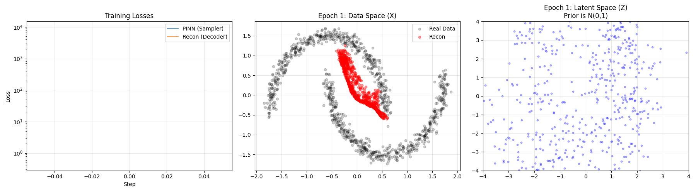

# Flow LVM

Latent Variable Modeling (LVM) using a learned Non-Equilibrium Transport Sampler (NETS) as the inference network. While standard Variational Autoencoders (VAEs) force the inference step into a restrictive Gaussian bottleneck, Flow LVM replaces the traditional encoder with a dynamic transport sampler that draws directly from a complex, unnormalized posterior density.

| Directory | Purpose |
| :--- | :--- |
| `vanilla/` | Core 2D toy setup demonstrating the fundamental mechanics (`sampler.py`, `models.py`, `train.py`). |
| `meta/`, `masked/` | Application to Bayesian meta-learning tasks. |

### Relevant Literature

- [NETS Paper](https://arxiv.org/abs/2410.02711) 
- [VAE Paper](https://arxiv.org/abs/1312.6114)

---

## 1. Theory and Intuition: NETS

### Intuition: The Energy Landscape

To sample from an unnormalized target density $\pi(z)=\frac{\gamma(z)}{Z}$, use the energy form:

$$
\pi(z)=Z^{-1}e^{-U_1(z)}.
$$

- Target energy: $U_1(z)=-\log\gamma(z)+C$.
- Partition function (Normalizer): $Z=\int e^{-U_1(z)}dz$ is unknown and not needed for sampling.

### The Transport Bridge

Bridge a simple base distribution (for example standard normal with energy $U_0(z)=\frac{1}{2}\|z\|^2$) to the target energy $U_1(z)$ with linear interpolation:

$$
U_t(z)=(1-t)U_0(z)+tU_1(z), \qquad \partial_t U_t(z)=U_1(z)-U_0(z).
$$

### Sampler Dynamics and PINN Loss

Samples are transported by an Euler-Maruyama SDE:

$$
z_{k+1}=z_k+\left(-\epsilon\nabla_z U_{t_k}(z_k)+b_\phi(z_k,t_k)\right)\Delta t+\sqrt{2\epsilon\Delta t}\xi_k.
$$

The drift network $b_\phi$ and free-energy network $F_\psi$ minimize the PINN residual:

$$
r=\nabla\cdot b_\phi-\nabla_z U_t \cdot b_\phi-\partial_t U_t+\partial_t F_\psi(t).
$$

The objective is $\mathbb{E}[r^2]$. In practice, $\nabla\cdot b_\phi$ is estimated with a Hutchinson estimator.

---

## 2. Application: Latent Variable Modeling (LVM) Setup

In a latent variable model, we infer hidden variables from observed data:

- Observed data $x$: empirical data to model.
- Latent variable $z$: hidden representation to sample.
- Prior $p(z)$: chosen as $\mathcal{N}(0, I)$.
- Likelihood / decoder: $p(x \mid z)$ modeled as $\mathcal{N}(\mu_\theta(z), \sigma^2 I)$ where $\mu_\theta$ is the decoder network.
- True posterior: $p(z \mid x)=\frac{p(x \mid z)p(z)}{p(x)}$.
- Evidence $p(x)$: intractable normalizer, equivalent to $Z(x)$.

In a standard VAE, $p(x)$ is intractable, so the posterior is approximated with an encoder $q_\phi(z \mid x)$, usually a diagonal Gaussian.

Flow LVM approach: drop the standard encoder and define the unnormalized target directly:

$$
\gamma(z \mid x)=p(x \mid z)p(z).
$$

This gives the sampler energy terms used in the code:

- Base energy (prior): $U_0(z)=\frac{1}{2}\|z\|^2$
- Target energy (unnormalized posterior): $U_1(z, x)=\frac{1}{2}\|z\|^2+\frac{1}{2\sigma^2}\|x-\mu_\theta(z)\|^2$
- Time derivative (`_dt_U`): $\partial_t U_t(z, x)=U_1-U_0=\frac{1}{2\sigma^2}\|x-\mu_\theta(z)\|^2$

---

## 3. Training Loop and Architecture

Standard VAEs train encoder and decoder jointly via the reparameterization trick. Here, the encoder is a dynamic SDE sampler, so `train_nets` alternates two optimization steps:

1. Sampler update (PINN): roll out the sampler, fetch batches of $(z, x, t)$ from a replay buffer, and minimize the PINN residual loss. Decoder parameters are frozen here to avoid trivial collapse.
2. Decoder update (MSE): draw latent samples $z$ using the updated sampler, reconstruct $\hat{x}=\mu_\theta(z)$, and minimize mean squared error.

---

## 4. Usage and Customization

- Running the toy example: execute `notebooks/vanilla.ipynb`. It uses a 2D Two Moons dataset, standard normal noise, $\epsilon=1.0$, and writes `nets_moons.png`.
- Defining a custom target: for a different posterior family, define a new target energy such as $U_1(z,x)=-\log(p(z)p(x \mid z))$. Then update `_energy_U`, `_grad_U`, and `_dt_U`; the remaining NETS transport logic stays the same.
